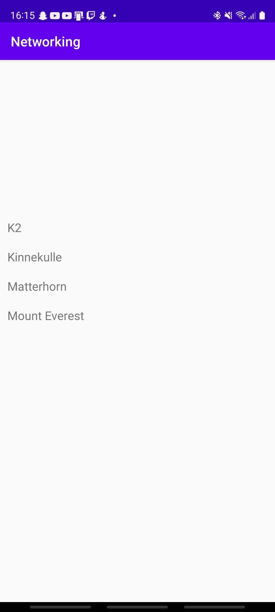

# Rapport
Denna upgift handlade om att använda JSON ifrån ett API i en RecyclerView. 

## MainActivity
I MainActivity används JsonTask i onCreate() för att starta onPostExecute() och låter den anväda URL för att hitta JSON strängen.

I onPostExecute() skapas en lista av java objekten som sedan matas in till adaptern så att den kan hantera det och lägga in dem i
recycler view.

Sisst så används *"notifyDataSetChanged();"* för att se till att om data ändras medans appen är öppen så ska den updateras. 

```java
public class MainActivity extends AppCompatActivity implements JsonTask.JsonTaskListener {

    private final String JSON_URL = "https://mobprog.webug.se/json-api?login=brom";
    ...
    ArrayList<Mountain> mountains= new ArrayList<>();
    Gson gson = new Gson();
    
    @Override
    protected void onCreate(Bundle savedInstanceState) {  
        ...
        new JsonTask(this).execute(JSON_URL);
    }
    
    @Override
    public void onPostExecute(String json) {
        Type type = new TypeToken<ArrayList<Mountain>>() {}.getType();
        ArrayList<Mountain> listOfMountains = gson.fromJson(json, type);
        RecyclerView view = findViewById(R.id.recyclerView);
        recyclerviewadapter adapter = new recyclerviewadapter (this, listOfMountains);
        view.setAdapter(adapter);
        view.setLayoutManager(new LinearLayoutManager(this));
        adapter.notifyDataSetChanged();
    }
}
```

## Mountain
Mountain är classen som hanterar objektet bärg som används för adaptern. 

## RecyclerViewAdapter
Adapterns jobb är att tolka JSON strängen till något som är läsbart och använbart till andorid. I detta fall tar den JSON strängen
och gör om den för att kunna skrivas ut i recycleviewen. 

```java
public class recyclerviewadapter extends RecyclerView.Adapter<recyclerviewadapter.MyViewHolder> {
    ...
    ArrayList <Mountain> mountains;
    public recyclerviewadapter(Context context, ArrayList<Mountain>mountains){
        ...
        this.mountains=mountains;
    }
    @NonNull
    @Override
    public recyclerviewadapter.MyViewHolder onCreateViewHolder(@NonNull ViewGroup parent, int viewType) {
        LayoutInflater inflater = LayoutInflater.from(context);
        View view =inflater.inflate(R.layout.recyclerviewitem, parent, false);
        return new recyclerviewadapter.MyViewHolder (view);
    }
    @Override
    public void onBindViewHolder(@NonNull recyclerviewadapter.MyViewHolder holder, int position) {
        holder.textview.setText(mountains.get(position).getName());
    }
    @Override
    public int getItemCount() {
        return mountains.size();
    }
    public static class MyViewHolder extends RecyclerView.ViewHolder{
        TextView textview;
        public MyViewHolder(@NonNull View itemView) {
            super(itemView);
            textview = itemView.findViewById(R.id.title);
        }
    }
}
```




